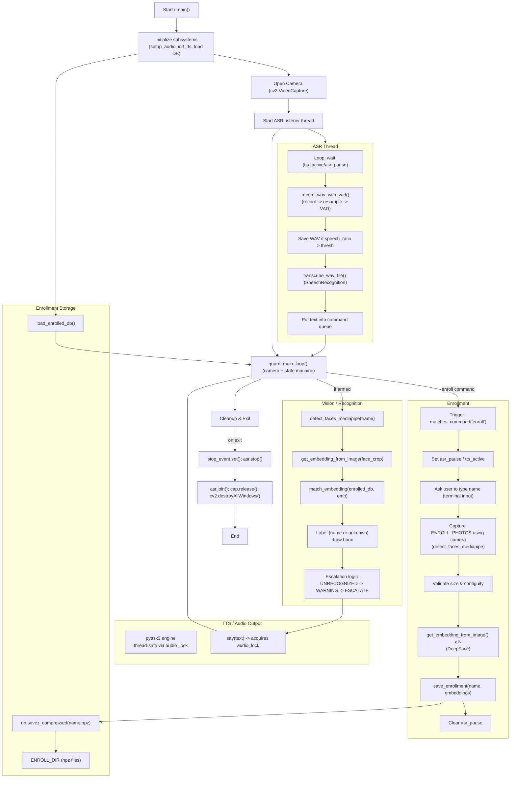

## Assignment #2 EE782 - AI Guard Agent

## Team
- Dhruv Meena 22b1279
- Madhava Sriram 22b1233

## To run

After cloning repo and making it current working directory.

### Activate virtual environment
```bash
python -m venv venv
venv/scripts/activate
```

### Install dependencies
```bash
pip install -requirements.txt
```
Note: You will need Pyaudio and webcrtvad modules. Install with conda/miniconda.

### Run Unit Tests
```bash
python test.py
```

### Run Guard Agent
```bash
python main.py
```

## Video
[Link](https://drive.google.com/drive/folders/1-zq1_mV51Z7O2tidyDMIm1MFsllde5FF?usp=sharing)

## FlowChart


